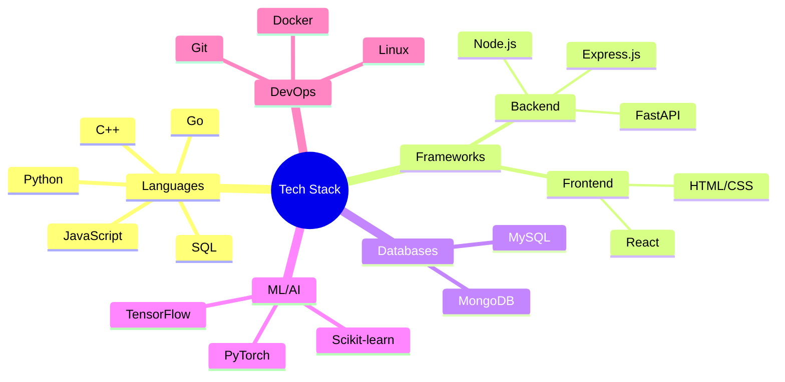

<div align="center">
  
  <!-- Custom Typing SVG -->
  [](https://git.io/typing-svg)

  <!-- 3D Contribution Calendar -->
  

</div>

<!-- Custom Banner -->


<div align="center">
  
  <!-- Snake Animation -->
  <picture>
    <source media="(prefers-color-scheme: dark)" srcset="https://raw.githubusercontent.com/Codealpha07/Codealpha07/output/github-contribution-grid-snake-dark.svg">
    <source media="(prefers-color-scheme: light)" srcset="https://raw.githubusercontent.com/Codealpha07/Codealpha07/output/github-contribution-grid-snake.svg">
    
  </picture>

  <!-- Profile Trophy -->
  [](https://github.com/ryo-ma/github-profile-trophy)

</div>

---

<table align="center">
  <tr>
    <td align="center" width="100%">
      
      
      
    </td>
    <td align="center" width="100%">
      
    </td>
  </tr>
</table>

<!-- Skills Section with Metrics -->
<details>
<summary><h2>🛠️ My Tech Arsenal</h2></summary>
<div align="center">



<!-- Detailed Skills Progress Bars -->
| Skill | Progress |
|-------|----------|
| Python |  |
| Go |  |
| JavaScript |  |
| Machine Learning |  |
| Problem Solving |  |

</div>
</details>

<!-- Projects Section with Advanced Formatting -->
<details>
<summary><h2>🚀 Featured Projects</h2></summary>

<div align="center">

<!-- Project Cards -->
<table>
  <tr>
    <td width="50%">
      <h3 align="center">🌆 CivicSense</h3>
      <div align="center">
        <a href="https://github.com/Codealpha07/civicsense" target="_blank">
          
        </a>
        <br>
        <a href="https://civicsense-4861.onrender.com/" target="_blank">
          
        </a>
      </div>
    </td>
    <td width="50%">
      <h3 align="center">🔊 AudiBliz</h3>
      <div align="center">
        <a href="https://github.com/Codealpha07/AudiBliz" target="_blank">
          
        </a>
        <br>
        <a href="#">
          
        </a>
      </div>
    </td>
  </tr>
</table>
</div>
</details>

<!-- Achievements Section -->
<details>
<summary><h2>🏆 Achievements & Metrics</h2></summary>
<div align="center">

<!-- Metrics Plugin -->


<!-- Coding Time Stats -->
<!--START_SECTION:waka-->
```text
Python       12 hrs 45 mins  ██████████░░░░░░░░░  45.2%
JavaScript   8 hrs 30 mins   ██████░░░░░░░░░░░░░  30.1%
Go           4 hrs 15 mins   ████░░░░░░░░░░░░░░░  15.3%
C++          2 hrs          ██░░░░░░░░░░░░░░░░░   7.2%
Other        35 mins        █░░░░░░░░░░░░░░░░░░   2.2%
```
<!--END_SECTION:waka-->

</div>
</details>

<!-- Connect Section with Animated Elements -->
<h2>🤝 Let's Connect!</h2>
<div align="center">
  <a href="https://www.linkedin.com/in/devugupta/">
    
  </a>
  <a href="mailto:your.email@example.com">
    
  </a>
  <a href="https://github.com/Codealpha07">
    
  </a>
</div>

<!-- Fun Elements -->
<div align="center">
  
  ### Current Mood
  ```python
  while alive:
      eat()
      code()
      sleep()
      repeat()
  ```
  
  <!-- Profile Views Counter -->
  

</div>

<!-- Footer -->


<!-- Hidden Gems -->
<details>
<summary>🎮 Want to play a game?</summary>
<div align="center">

  ### GitHub Contribution Game of Life
  [](https://github4life.herokuapp.com/Codealpha07)

</div>
</details>
